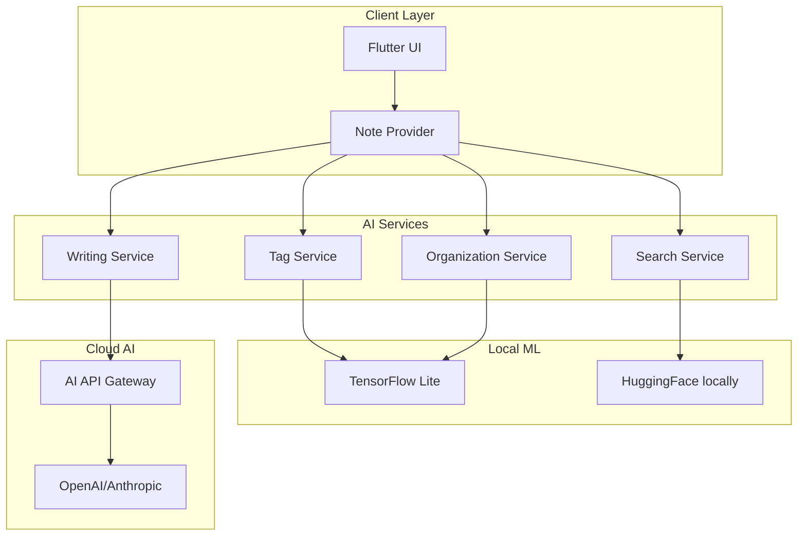

# AI Integration Plan for n0tes Note App

## Current App Analysis

Your note app "Quicknotes" (n0tes) is a well-structured Flutter application with:
- **Local storage** using Hive (offline-first)
- **Rich text editing** via flutter_quill
- **Organization**: Folders, tags, pinned/archived notes
- **Search**: Keyword-based search
- **Features**: Grid/list views, color customization, share functionality

---

## Unique AI Integration Suggestions

### 1. 🎯 AI-Powered Smart Tags
**What it does**: Analyzes note content and automatically suggests relevant tags.

**How it works**:
- Uses local ML (TensorFlow Lite) or API-based NLP
- Extracts keywords, entities, topics from note content
- Suggests 3-5 relevant tags with confidence scores

**Implementation**:
```
New file: lib/services/ai_tag_service.dart
- Add method: Future<List<TagSuggestion>> suggestTags(String content)
- Integrate into NoteEditorScreen as floating suggestion chip bar
- Store learned preferences in local storage
```

**Unique twist**: "Tag Evolution" - AI learns your tagging patterns and prioritizes your frequently used tags.

---

### 2. ✍️ AI Writing Assistant
**What it does**: Real-time writing enhancement within the editor.

**Features**:
- **Grammar & Style**: Inline suggestions for improvements
- **Autocomplete sentences**: AI continues your thoughts
- **Tone adjustment**: Convert casual → formal or vice versa
- **Expand bullet points**: Flesh out short notes into detailed content

**Implementation**:
```
New file: lib/services/ai_writing_service.dart
- Add floating AI action button in RichTextEditor toolbar
- Implement sidebar panel for AI suggestions
- Support undo for AI-generated content
```

**Unique twist**: "Write like [famous person]" - Transform your writing style to match famous writers or custom profiles.

---

### 3. 📝 Smart Note Summarization
**What it does**: Automatically generates summaries of long notes.

**How it works**:
- On-the-fly summarization using local or cloud ML
- Configurable summary length (1 sentence, paragraph, bullet points)
- Highlight key points in the original note

**Implementation**:
```
New method in NoteProvider: Future<String> summarizeNote(String noteId)
- Add "Summarize" action in note menu
- Display summary as collapsible header in note view
- Store summary cache for quick retrieval
```

**Unique twist**: "Meeting Pulse" - For meeting notes, extract action items, decisions, and key dates automatically.

---

### 4. 🔍 Semantic Search Engine
**What it does**: Search by meaning, not just keywords.

**How it works**:
- Convert notes to vector embeddings (on-device or API)
- Find related notes even without keyword matches
- "Search by example" - Find notes similar to a selected note

**Implementation**:
```
Enhance: lib/services/database_service.dart
- Add: Future<List<Note>> semanticSearch(String query)
- Create: lib/services/embedding_service.dart
- Modify: lib/providers/note_provider.dart search logic
```

**Unique twist**: "Search Safari" - Visual exploration of search results as a knowledge graph showing connections between notes.

---

### 5. 🧠 Auto-Organization (AI Curator)
**What it does**: Suggests folder placements and creates intelligent collections.

**Features**:
- Suggests which folder a new note belongs in
- Creates smart collections based on topics/themes
- Detects duplicate or similar notes

**Implementation**:
```
New file: lib/services/ai_organization_service.dart
- Add suggestion banner on home screen
- Create "Smart Folders" that auto-populate
- Add duplicate detection alerts
```

**Unique twist**: "Digital Garden" - Visualize your notes as a growing garden with AI suggesting which "seeds" (ideas) to nurture together.

---

### 6. 🎨 AI Theme & Design Suggestions
**What it does**: Suggests colors and layouts based on note content mood.

**How it works**:
- Analyzes note content for emotional tone
- Suggests color palettes that match the mood
- Recommends formatting improvements

**Implementation**:
```
New file: lib/services/ai_design_service.dart
- Add mood detection in NoteProvider
- Suggest colors in color picker dialog
- Auto-format option in editor
```

**Unique twist**: "Time-of-Day Themes" - Suggest different note colors/wallpapers based on when you're typically most productive.

---

### 7. 🚀 Content Generation Templates
**What it does**: AI-generated templates for common note types.

**Templates**:
- Meeting agenda & notes
- Daily journal prompts
- Project briefs
- Recipe cards
- Travel itineraries
- Book/movie reviews

**Implementation**:
```
New file: lib/services/ai_template_service.dart
- Add "AI Templates" section in new note screen
- Include customizable prompts for each template
- Learn from your editing patterns
```

**Unique twist**: "Template Mixer" - Combine elements from multiple templates to create custom ones.

---

### 8. 📅 Smart Date Extraction
**What it does**: Identifies dates, deadlines, and events in notes.

**Features**:
- Auto-highlight dates mentioned in notes
- Suggest calendar events from note content
- Create follow-up reminders automatically

**Implementation**:
```
Enhance: lib/widgets/rich_text_editor.dart
- Add date detection overlay
- Integrate with device calendar (optional)
- Add reminder creation dialog
```

**Unique twist**: "Deadline Heatmap" - Visual calendar view showing all deadlines extracted from your notes.

---

### 9. 🎤 Voice Note Intelligence
**What it does**: Transcribes and structures voice recordings.

**How it works**:
- Record voice within the app
- AI transcribes and segments by speaker/topic
- Converts to structured notes automatically

**Implementation**:
```
New file: lib/services/voice_ai_service.dart
- Add microphone button in editor
- Use speech-to-text API
- Add speaker diarization (who said what)
```

**Unique twist**: "Voice Emoji" - AI detects emotion in voice notes and adds appropriate emoji reactions.

---

### 10. 🔗 Cross-Note Connections
**What it does**: Discovers hidden connections between your notes.

**Features**:
- Suggests related notes while editing
- Creates "knowledge graph" visualization
- Finds contradictions across notes

**Implementation**:
```
New file: lib/services/connection_service.dart
- Calculate note embeddings similarity
- Add "Related Notes" section in note view
- Visual graph in separate screen
```

**Unique twist**: "Idea Spark" - Randomly surface forgotten notes that might relate to what you're currently writing.

---

## Recommended Implementation Priority

| Priority | Feature | Complexity | Impact |
|----------|---------|------------|--------|
| 1 | Smart Tags | Medium | High |
| 2 | Semantic Search | High | High |
| 3 | Writing Assistant | Medium | High |
| 4 | Summarization | Medium | Medium |
| 5 | Auto-Organization | High | Medium |
| 6 | Templates | Low | Medium |
| 7 | Date Extraction | Low | Medium |
| 8 | Voice AI | High | Medium |
| 9 | Theme Suggestions | Low | Low |
| 10 | Cross-Note Connections | High | Medium |

---

## Technical Architecture Considerations



### Offline-First Approach
- Use on-device ML (TensorFlow Lite) for basic features
- Cloud AI for advanced features with user consent
- Cache AI results locally for instant retrieval
- Sync learning when online

---

## API/Service Recommendations

1. **On-device**: TensorFlow Lite, ML Kit
2. **Cloud AI**: OpenAI API, Anthropic, Google AI
3. **Search**: Weaviate (local vector DB), Pinecone
4. **Speech**: Whisper (OpenAI), Google Speech-to-Text

---

## Next Steps

1. Choose 2-3 features to implement first
2. Decide on on-device vs cloud AI approach
3. Set up API keys and services
4. Create service architecture
5. Implement incrementally with user feedback

Would you like me to elaborate on any specific feature or start implementing one of these AI integrations?
